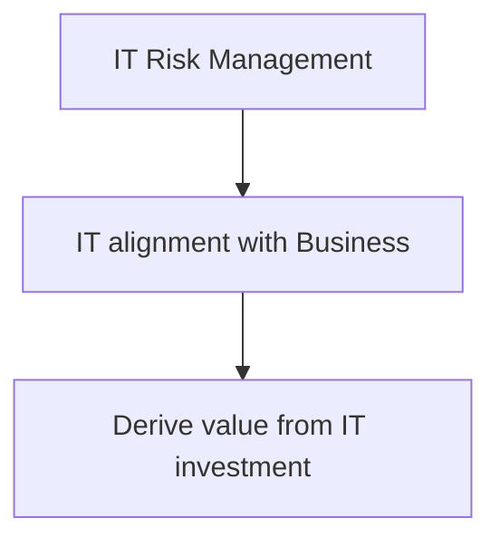

Process used to monitor and control IT activities

Objective 1:
	Ensures that IT activities are aligned with business objectives
Objective 2:
	Ensures that IT risks are appropriately addressed
Objective 3:
	Ensures that IT provides added value to business processes

Ensures optimum use of technology

- Primary reason for reviewing organizational chart?
	==Hierarchal structure, roles and responsibilities of individuals==
- To understand the structure of the organization
- How to determine if IT adds value to the organization
- Alignment of IT strategy with organizational strategy
- Who has the final responsibility for IT governance
	==Board of Directors==
- What is the main objective of IT governance
	==Optimum use of technology resources
- What is the purpose of corporate governance?
	==Provide strategic business direction==

