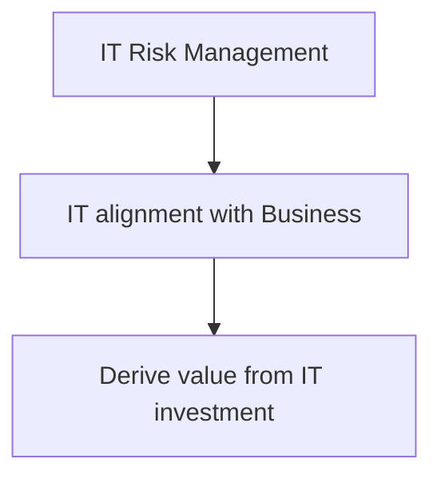
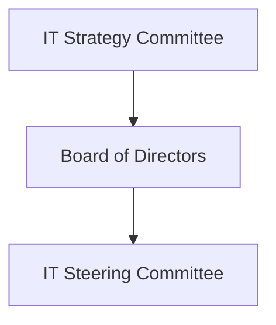
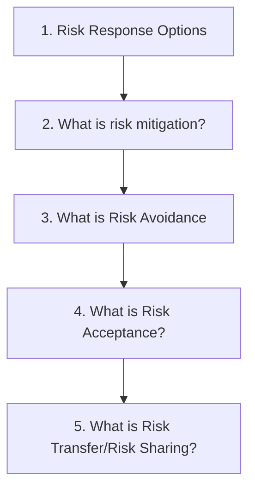
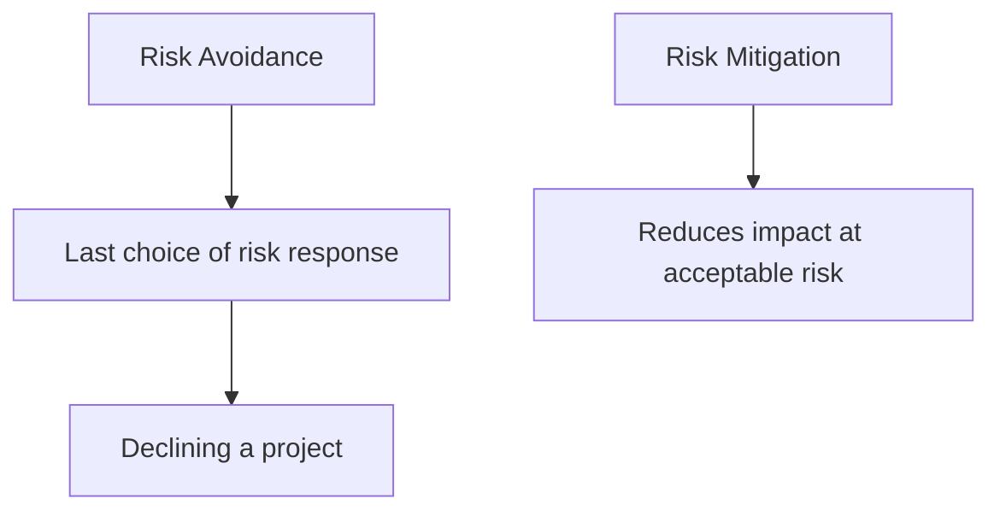
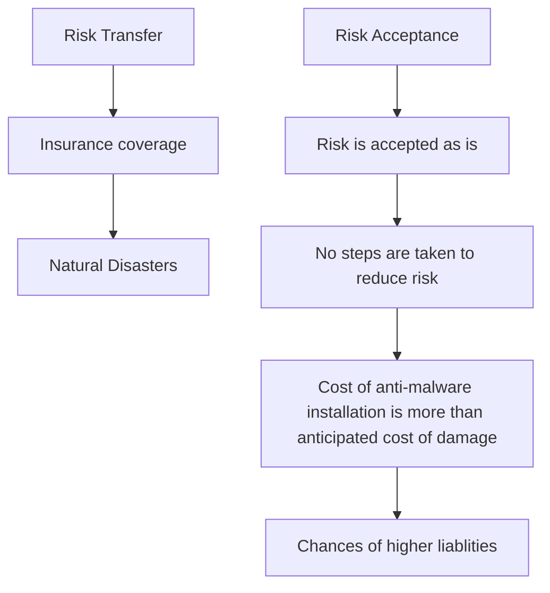
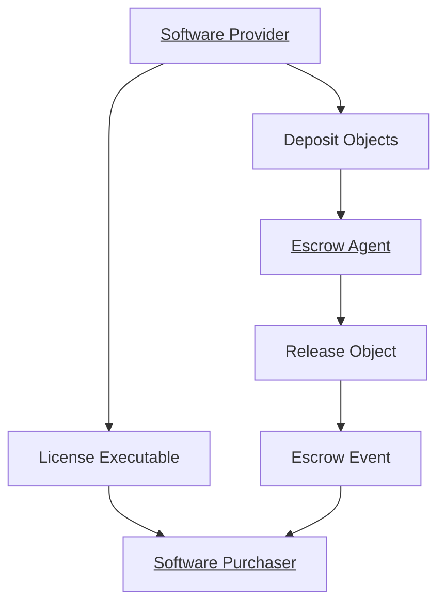
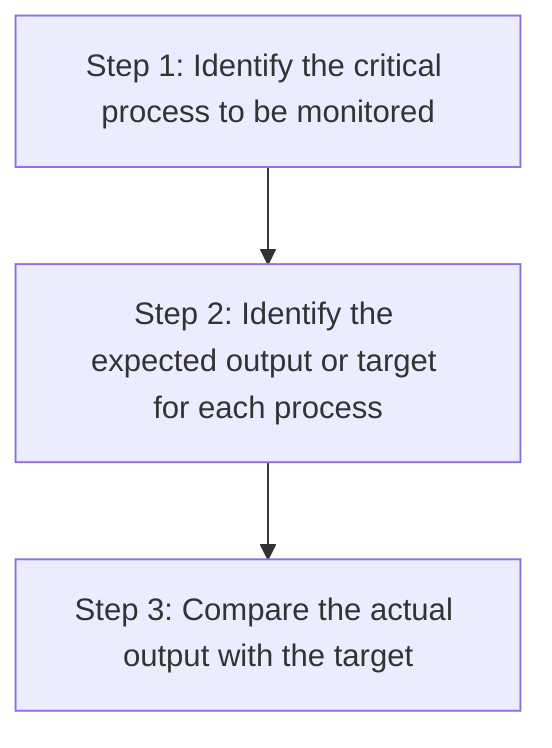

EGIT 
---

^0f6c0d

Process used to monitor and control IT activities

Objective 1:
	Ensures that IT activities are aligned with business objectives
Objective 2:
	Ensures that IT risks are appropriately addressed
Objective 3:
	Ensures that IT provides added value to business processes

Ensures optimum use of technology

- Primary reason for reviewing organizational chart?
	==Hierarchal structure, roles and responsibilities of individuals==
- To understand the structure of the organization
- How to determine if IT adds value to the organization
- Alignment of IT strategy with organizational strategy
- Who has the final responsibility for IT governance
	==Board of Directors==
- What is the main objective of IT governance
	==Optimum use of technology resources
- What is the purpose of corporate governance?
	==Provide strategic business direction==

IT Policies, Procedures and Standards
---
Policy
---
Provides the direction regarding acceptable and unnaceptable behaviors and actions
High level statement which provides the intent of expectations of management

Guidelines and Procedures
---
Provide detailed do's and don'ts to support the organizations policies
	- Who will be responsible for the antivirus?
	- How will the antivirus updates be carried out?
	- Who monitors and reviews the process

Standards
---
Mandatory requirement to be followed to comply with the framework or certification
	- ISO 27001

Most important action following the dismissal of an employee:
	==Disabling their rights of access==
Info Sec policy should be approved by:
	==The board of directors==

Approaches for Policy Development
---

Top Down Approach
--

^b0af3b

- Policy is developed and designed from a senior management perspective
- Policies are developed and aligned with business objectives
- ==Advantage: ensures consistency across organization
- Involvement of senior management in designing policies is of upmost importance
- Major risk to business objectives are addressed here

Bottom Up Approach
--

^fa9e59

- Policies are designed and developed from the the process owner's/employee perspective
- Begins by defining operational requirements and policies
- ==Implemented on the basis of risk assessment
- Process-level risk are addressed here

- An organization should make use of both top-down and bottom-up approaches when developing policies
- They compliment each other and should be used simultaneously

Information security policy should be approved by:
==The Board of Directors==

Organizational Structure - Roles and Responsibilities
---

Board of Directors
---

^31eb7f

Primarily responsible for IT governance

IT Strategy Committee
--

^55cbdc

Advise board on IT strategy

IT Steering Committee
--

^eca6a3

- Provides direction
- Monitor IT projects
- Ensure alignment between IT and business objectives

System Development Management
--
- Provides technical support

User Management/Project Sponsor
--

^da41d0

- Assume ownership of the project and resulting system
- Provides functional requirements
- Reviews and approves deliverables

IT Strategy and IT Steering
---

| Strategy Committee | Steering Committee |
|------------------------|-----------------------|
| Board Members and Specialized non-board members | Executives. CIO and other functionaries required |
| Advises board and senior management on IT strategy | Focuses on Implementation |
| <u> Responsibilities:</u> | <u> Responsibilities:</u> | 
| Alignment of IT with business objectives | Implementation as per direction of board |
| Exposure to IT risk | Approves project plans and budget | 
| Direction to management related to IT Strategy | Setting priorities and milestones | 
| Contribution of IT to the business | Acquires and assigns appropriate resources |
| | Ensures project meets the business requirements and continuous monitoring |
| | Ensures efficient use of IT resources |

Board Memm

Enterprise Architecture
---

^3bb20e

Defines the structure and the operations of the organization
- Ensures that technology initiatives are compatible with the IT framework. 
- The goal of EA is to help the organization adopt the most successful technology
The Zachman framework is one of the first EAs
- Fundamental EA structure that provides a formal and structured way of viewing and defining an enterprise

Current and Future Objectives
--
1. The objective of EA is to determine how an organization can achieve its current as well as future objective
2. The EA must include the entire future outcome or it remains incomplete.

> [!question] - Question 1
An IS auditor finds that an organization has 2 seperate EAs; one for current state representation, and another to build a future-state representation. The IS auditor should:

A. Suggest finishing the separate project as early as possible
B. Report the problem in the audit report as an observation
C. Suggest implementation of the Zachman Framework
D. Extend the scope of the audit to include the separate project as part of the current audit

[[B. Report the problem in the audit report as an observation|Answer]] 

> [!question] - Question 2
> Which of the following is the most important advantage of open system architecture?

A. It facilitates the use of free software
B. It facilitates the integration of proprietary components
C. It will constitute a basis for discounts from the equipment vendor
D. It facilitates the attainment of further economics of scale for equipment

[[B. It facilitates the integration of proprietary components|Answer]] 

The first step in developing a security architecture is to establish a security policy for information and related technology.
	A security policy provides customers, administrators and technical staff with a consistent security framework

Risk Treatment Options
---
Testing Concepts
--

Risk Response Options
--

^c9f6fb

Mitigation - Reduction
Acceptance
Avoidance
Transfer - Sharing

| Risk Response Options | Explanation | Examples |
|--------------------------|---------------|-------------------------------------|
| RIsk Mitigation | Objective is to reduce the risk to an acceptable level. To reduce the probabliity of a risk event, controls are designed appropriately. | Installing a firewall to mitigate the risk of unauthorized access |
| Risk Acceptance | Risk is accepted. No steps are taken. Prevalent when cost of controlling the risk is more than the cost of the risk event. ==MOST RISKY== | Cost of anti-malware installation is more than cost of anticipated damage due to malware attack |
| Risk Avoidance | Projects or activities that the risk are avoided. Last choice when no other response is adequate. | Declining a project when business case shows a high risk of failure |
| Risk Transfer | Risk is shared with partners or transferred via insurance coverage, contractual agreements, or other means. Usually used for an event with low probability but high impact.| Taking insurance for damages due to natural disaster with very low probability but a high impact |

Risk Analysis Methods
---
Process of ranking various risk so that areas of high risk can be prioritized for treating them.
Risk can be measured and ranked using the following method
	1. Quantitative Risk Assessment
	- Measured in numerical values
	- Dollar amount or percentage
	2. Qualitative Risk Assessment
	- Risk is measured on quality parameters
	- High, Medium, Low
	3. Semi-quantitative Risk Assessment
	- Combination of qualitative and quantitative risk assessment
	- High, medium, low is given some quantitative weightage.
		- EX: High Risk = 5, Medium Risk = 3, Low Risk = 1

Which method should be used?
--
Quantitative - ==A risk practitioner should always prefer quantitative approach==. Puts the risk into monetary returns, making it easier to compare various risk responses ^a5fc17
- the major challenge is the availability of accurate data.
- ==in these instances, qualitative analysis is preferred==

Risk = Probability x Impact

Factors required to quantify the risk:
--
Probability and Impact
	- Also referred as possibility or likelihood
	- Impact is also referred to as consequences

Which method is used to derive the risk
	-Quantitative
Financial impact can be derived from:
	-Quantitative risk analysis
What method is best to get comprehensive results when performing a qualitative risk analysis?
	- To determine scenarios with impact
Most important factor in quanititative risk analysis process is?
	- Expected monetary value (EMV) ^adf912

Enterprise Risk Management
--
Includes all the risk which impact an enterprise
- the practice, methods and processes adopted by organizations to manage and monitor risks across the organization
- ERM is a structured process for managing various risks that can adversely impact business objectives

What is the first step in implementing a risk management approach?
	1. Asset identification
		1. Determine the threat, vulnerability and risk profiles of the organization.

What indicates the exchange of risk?
	Transfer Risk ^56e97e

Capability Maturity Model
--
Useful to determine maturity level of risk management process

| Level | Category | Explanation |
|---------------|-----------------------|-----------------------------|
| Level 0 | Incomplete | Process is not implemented or does not achieve intended purpose |
| Level 1 | Performed | Process is able to achieve its intended purpose |
| Level 2 | Managed | Process is appropriately planned, monitored and controlled||
| Level 3 | Established | Process is well defined, documented and established |
| Level 4 | Predictable | Process is predictable and operates within defined parameters to achieve its intended purpose |
| Level 5 | Optimized | Process is continuously improved to meet current as well as projected goals |

==NO DIRECT QUESTIONS ABOUT LEVELS OF CMM ON CISA EXAM==

- Maturity models identify the gaps between the current state of process and the desired state
- Helps the organization determine necessary action to improve
- Constant Improvement

Advantages of CMM:
1. A Matured organization is more likely to prevent, detect and recover rapidly from incidents
2. Best technique to enable peer review of an organizations risk management process

Requirements of CMM:
1. Requires an organization to have the defined standard and reliable process that it follows consistently and continuously seeks to improve.
2. Level of performance is the most important factor when using a CMM. Performance is achieved when the objective of the implemented process is met.

Key Aspects:
- Measuring the existing level of risk management process against their desired state is best done through the Capability Maturity Model (CMM)
- The objective of CMM is constant improvement.
- The most important criteria is performance
- CMM is based on standard, repeatable and measurable processes.

Laws and Regulations impacting Organization
---
Objectives:
- laws and regulations are being enacted to protect the interest of stakeholders
- In the IT field, the most common objectives of laws and regulations include:
	- Safeguarding privacy and the confidentiality of personal data
	- Protection of IP rights
	- Integrity of financial information
==NO DIRECT QUESTIONS ON CISA EXAM CONCERNING PARTICULAR LAWS OR REGULATIONS==

IS auditors role in determining adherence to laws and regulations
--
- has an organization identified applicable laws and regulations pertaining to the org.
- How are the governance, risk and compliance program implemented within the organization
- Has an organization operating in multiple jurisdiction determined the legal and regulatory requirements for all operation areas
- Has overall responsibility for adherence to regulatory requirements been assigned to an individual at senior management levels
- Is an appropriate monitoring, auditing and reporting process in place relating to legal and regulatory requirements.

Key Aspects:
- Privacy laws are a major factor to be considered  in relation to offshore data storage/transfer
- Concerns regarding the use of cloud services:
	- Compliance with laws and regulations
	- Data confidentiality

IT Resource Management
--
What is the objective of the software escrow agreement?
	- Address the risk of the closure of vendors for customized written software

Mandatory Holidays (Purpose)
--
Detect fraud or illegal acts.
_____________________________
Job Rotation (Primary Objective) 
--
Detect improper or illegal employee acts
__________________
Transaction and Log Monitor 
--
- Primary compensating control for absence of segregation of duties

- First step when employee is terminated is to revoke the employees access to all systems

- Primary consideration when reviewing the IT priorities and coordination.
	Answer: Alignment of the project with business objectives

- Which of the following role(s) should not be trusted to a single individuals
	Answer: System Administrator and Application Developer
________________________
IT Service Provider (Outsourcing Contracts)
---
When outsourcing contracts:
- Written Contract
- IPR Clause
- Data Privacy Clause
- BCP/DRP Clause
Advantages to outsourcing:
	1. Expert Service
	2. Cost-Saving
Things to Remember:
	1. Legal Jurisdiction
	2. Privacy Laws
___________________________
Role of IS Department
--
- Monitoring the outsourcing provider's performance
- Managing compliance with the contract for the outsourced services

> [!question] - Question 1
An organization has outsourced some of its IS processes. What is the most important function to be performed by IS management in such scenario.

A. Ensuring that outsourcing charges are paid as per SLA
B. Training to staff of outsourced vendors
C. Levy of penalty for non-compliance
D. Monitoring the outsourcing provider's performance

[[D. Monitoring the outsourcing provider's performance|Answer]]

>[! question] - Question 2  
>An organization has outsourced its software development process. Which of the following is the responsibility of the organizations IT management?

A. Ensuring that outsourcing charges are paid as per SLA
B. Levy of penalty for non compliance
C. Managing compliance with the contract for outsourced services
D. Monitoring regulatory requirements

[[C. Managing compliance with the contract for outsourced services|Answer]]
_______________________
IT Performance Monitoring and Reporting
---
---------------------------------
Performance Metrics
--

^e3300f

Tools and techniques to evaluate the performance of processes

Developing Performance Metrics Steps
--

Best Practices
--
- Targets should be set from the top down and should be aligned with business goals
- Targets should be approved by stakeholders, and accountability and responsibility for achieving targets should be clearly defined.
- Data should be readily available to be used for metric measurements. The data should be complete, accurate, and correct.
- All key IT processes should have proper metrics

Six Sigma
--
^39372f
Quantitative process analysis methodology for process improvement and reduction of defects.
==Anything outside the customer specification is defined as a Six Sigma defect==

________________________________
Lean Six Sigma
--
^c7bd79
Seeks to remove unnecessary steps that do not add value
_________________
IT Balanced Score Card (IT BSC)
--
One of the most effective IT governance tools and shows the efficiency and value creation of the IT team and measures IT performance, risks, and capabilities.

**Measures effectiveness related to:**
- <b>C</b>ustomer Satisfaction
- <b>I</b>nternal Processes
- <b>A</b>bility to innovate
 
==BSC helps measure alignment of IT with business needs==

**How to measure:**
- Each parameter should have defined KPUs that can be evaluated to measure performance.

Objective of IT BSC
--
- Measure and evaluate performance of IT
- Optimize the performance
______________
Key Performance Indicators (KPI)
--
Used for measuring performance against predetermined goals.

Key indicator of goal achievement. Show abilities, practices and skills.
__________________________________________
Benchmarking
--
Includes evaluating and comparing the business processes and performance metrics with other organizations best practices

Helps implement processes in the most effective way.
_________________
Business Process Reengineering
--
BPR is the process of redesigning the processes/functions to improve the performance and cost reduction.
_________________
Root Cause Analysis
--
Finding the basic cause of something in order to understand the cause of a given incident.

One the root cause analysis is performed, effective corrective action is taken to prevent the system failure or deficiency

Helps correct errors and issues and prevent the issue from reoccurring.
_____________
Life Cycle Cost Benefit Analysis
--
Used to determine the overall cost of the project throughout the project lifespan such as the maintenance and upgrade of IT infrastructure.

==Cost is compared to expected benefits==
____________________
Key Aspects on CISA exam
---
- What is the prerequisite for implementing a balanced scorecard.
		Availability of key performance indicators.
- What is the primary objective of an IT performance measurement process?
		To optimize performance
- What is the best method to understand the effectiveness of an organizations IT asset planning and management?
		Analyze the IT balanced scorecard
- What is the risk of a lack of measurable performance indicators?
		Misleading indications of IT performance could be presented to management
________________________

Quality Assurance and Quality Management
---
QA aims to provide adequate confidence that an item or product conforms to requirements.

QA staff verify that changes to the system are approved, checked and implemented in a controlled manner.

==Process Oriented
Prevents the defect==
_____________________________________
Quality Control
--
QC is a method of performing testes or reviews to verify that the product is free of defects and meets the user's requirements and specifications.

==Product Oriented
Finds the defect==

- QC team is responsible for ensuring the program meets consumer standards and is free from defects
- QC must be completed before the program moves to development
- Recommended QC is autonomous, and independent within the company in order to achieve successful QC output

Segregation of Duties (SoD)
--

^84e757

- The role of QC should not be performed by an individual whose position would create the SoD
- An individual should not review their own work.

___________________________________
- Primary object of implementing a quality management system?
	Answer: Continuous Improvement

