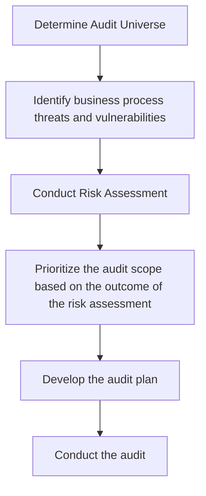
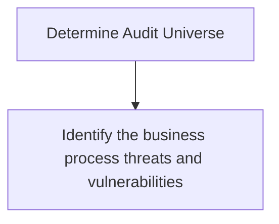
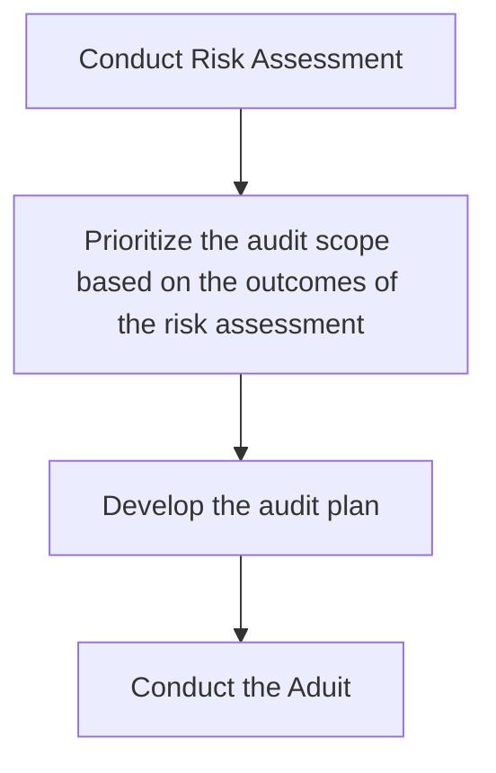

***21 % of Exam**

Understand role of the Audit
Plan and conduct an audit
Communicate Results
Manage Follow Up Activities

**Lesson 1: Audit Fundamentals
Exam Preparation Topics

1.1 Understanding the Audit Function
---

^873bbe

Terminology
IS Audit
--
Formal examination, interview or testing of information systems

Information Systems (IS)
--

^a33bb0

Defined as a combination of strategic, managerial, and operational activities related to the use of info and associated technologies

Information Technology (IT) 
--

^885e54

defined as hardware, software, communications and infrastructure used to store, process and transmit data

Assurance
--

^c1ffef

Positive declaration intended to give confidence.
- The purpose of a IS audit is to provide assurance that info systems are working as intended and if not, document the discrepancy and as applicable, provide recommendations.
	A. Authority should be conferred by the highest level of management and codified in an audit charter
	B. IS Audit Charter - establishes the role of the audit function
		- Includes authority, objectives, responsibilities and reporting lines
		- Should address both internal and external audit functions
IS Audit Universe
--
includes all systems that should be audited as part of the overall cycle of planned work ^10d21d
- Serves as the source from which the annual audit schedule is prepared
Audit Plan
--
high level description of audit work performed in a specific time frame.
	Plan includes:
		1. Objective
		2. Scope
		3. Resource Requirements
		4. Intended Evidence Collection Techniques
		5. Target Audience
		6. Expectations

Risk Based Audit plan
--
relies on quantitative and/or qualitative risk assessments to narrow the audit universe.

Auditor Responsibility
--
1. Adhere to professional standards
2. Be fair, competent, and accurate
3. Understand the audit target environment
4. report any conflict of interest or independence
5. Add Value

_______________________________________________________________

**1.2 Adhering to ISACA IS Audit
---

Code of Professional Ethics
		1.  Support the implementation of, and encourage compliance with, appropriate standards and procedures for the effective governance and management of enterprise information systems and technology, including: audit, control, security and risk management.
		2.  Perform their duties with objectivity, due diligence and professional care, in accordance with professional standards.
		3.  Serve in the interest of stakeholders in a lawful manner, while maintaining high standards of conduct and character, and not discrediting their profession or the Association.
		4.  Maintain the privacy and confidentiality of information obtained in the course of their activities unless disclosure is required by legal authority. Such information shall not be used for personal benefit or released to inappropriate parties.
		5.  Maintain competency in their respective fields and agree to undertake only those activities they can reasonably expect to complete with the necessary skills, knowledge and competence.
		6.  Inform appropriate parties of the results of work performed including the disclosure of all significant facts known to them that, if not disclosed, may distort the reporting of the results.
		7.  Support the professional education of stakeholders in enhancing their understanding of the governance and management of enterprise information systems and technology, including: audit, control, security and risk management.

Standards and Guidelines
---

Standards contain mandatory req for IS Audit and Assurance activities
-Contain recommendations for apply IS audit standards
-Legal and regulatory requirements supersede ISACA standards and guidelines

Reference material on isaca.org

Tools & Techniques
---
1. Whitepapers
2. Programs
3. COBIT 5 Products
4. ISACA Journal1it Relationship
_____________

Risk Primer
---
| Risk | protentional of undesirable outcome|
|-----------|-----------------------------------|
| Risk Management | method to determine the level of risk associated with a process, activity, or system. |
| Impact | Magnitude of harm |
| Likelihood | Weighted factor.|
| Inherent Risk | level of risk before controls are implemented |
| Residual Risk | level of risk after controls are implemented |
_________

Threat Primer
---
| Threat | Potential Danger |
|--------------|-----------------------------------|
| Adversary | Specific instances of threat|
|Threat modeling | identifying and categorizing potential threats |
| Vulnerability | weakness |
| Exploit | Thread adversary successfully takes advantage of a vulnerability |
| Control | measure designed to prevent, deter, detect, respond or recover from a threat source |
________________________________
Audit Process
--

______________
Risk Audit Relationship 
---
- Risk Identification drives the audit process and contributes to the audit methodology.

_______________
Risk Assessment
---

_________________
1.4 Surverying IS Controls
---
Control - tactic, mechanism, or strategy to either:
		-Reduces or eliminates vuln
		-Reduces or eliminates the likelihood that a threat agent will be able to exploit a vuln
		-Reduces or eliminates the impact of an exploit
