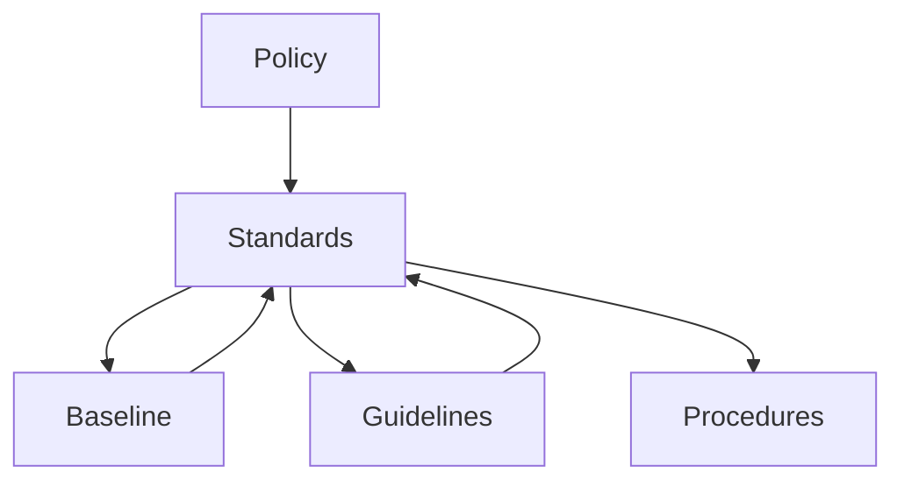
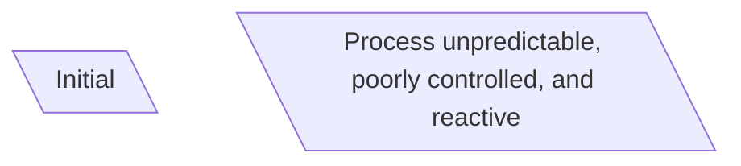
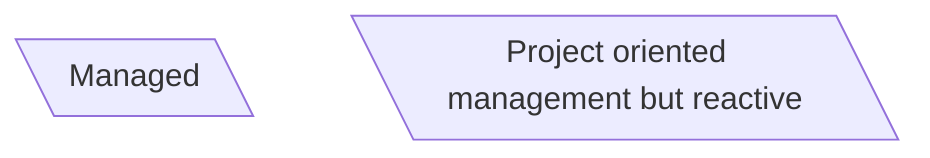
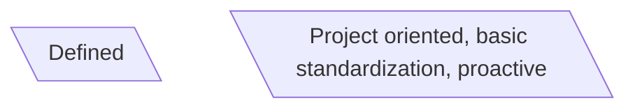
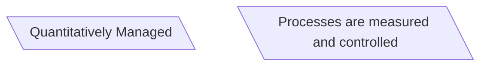
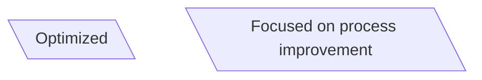

<i><b><u>3.1 Understanding Corporate and Information Security Governance</i></b></u>
	- Governance is about big picture management and leadership
	- The objective of corporate governance is responsible leadership with the goal of achieving organizational objectives, reducing risk, optimizing resources for eval, setting direction, and effective monitoring.
	<u>GEIT</u>
	 - Governance of enterprise IT focuses on the strategic alignment of IT and organizational objectives with the goal of delivering value and managing risk
		 - Management of enterprise IT focuses on the tactical alignment of IT and organizational objectives
	<i><b>Cybersecurity Governance</i></b>
			- Responsibility of leadership to
				1. Determine and articulate the organization's desired state
				2. Provide the strategic direction, resources, funding and support to reach the desired state of security
				3. Maintain responsibility and accountability through oversight
_______

**Governance Outcomes**
	1. <u>Strategic alignment</u> - align dept strat with bus strat
	2. <u>Risk Management</u> - mitigate risk to acceptable level
	3. <u>Value Delivery</u> - Optimize investments in support of business objectives
	4. <u>Resource Management</u> - Ensure efficient and effective use of resources
	5. <u>Monitor and report achievement</u>
	6. <u>Process Integration</u> - Achieve operational synergies and efficiencies
______________________

**GEIT Frameworks**

| Framework | Uses |
|------------------------- | --------------------------------------------------------------------------------------------------|
| <u>COBIT 5 - ISACA</u> | Align IT with business objectives, maximize benefits, optimize resources and manage risk |
| <u>ITIL - OGC</u> | Business value delivery and successful operational service management
| <u>ISO 38500 - ISO/IEC</u> | Effective governance of IT
| <u>ISO 200000 - ISO/IEC</u> | Specifications for service management
| <u>ISO 27001 - ISO/IEC</u> | Standards for implementing and maintaining an information security program

<b>Balanced Scorecard</b>
Strategic planning and management tool used to align business activites and strategic goals
	- BSC provides a bridge between IT and business objectives by supplementing traditional financial evaluation with measures to evaluate customer satisfaction, internal processes and innovation
	- Sufficient number of performance drivers measured in KPI

<i><b><u>3.2 Designing Strategic Plans, Policies, and Procedures</i></b></u>
	Organizational Leadership 
		Leadership's responsibilities
			- Determine/articulate organization's desired state
			- Communicate Expectations
			- Provide strategic direction, resources, funding and support to ensure that the desired state can be achieved and sustained
			- Maintain responsibility and accountability through oversight
		Strategic plans and orgnization policies are fundamental governance tools
	<b>Strategic Planning</b>
	- management tool
		- Helps organization ensure that its members are wosrking towards the same goal and assess and adjust the orgs. direction in response to a changing environment.

<b> VMOSA Structure </b>

| Element | Purpose |
|---------------------|----------------------------------------------------------------------------------------------------------------|
| Vision | The big picture (the dream) : Inspiring phrase or statement that should fit on a tee |
| Mission | The purpose (the what and the why) : Concise and outcome oriented
| Objectives | The specific goals (idea form) : Specific measurable steps to achieve the mission
| Strategies | The steps (the how and when) : The approach needed to achieve the objectives
| Action Plan | The details (assignable tasks) : Specifics as to who will do what, by when, and with what resources

**Policies**
	- High level statements intended to communicate expecations and provide direction
	- Policies should be relevant, realistic, attainable, and enforceable.
	- If applicable, policies clearly delineate exceptions

Policy Lifecycle Responsibilities
| Position | Develop | Publish | Adopt | Review |
|-------------|---------------|------------------|---------------------------------------|--------------------------------|
| Board of Directors or Executive Mgmt | Communicate guiding principles. Review and authorize policy | Champion the policy | Lead by Example | Reauthorize or approve retirement
| Operational Mgmt | Plan, research, write, vet, review, and approve | Communicate, disseminate, and educate | Implement, evaluate, monitor, enforce | |

**Common Infosec Policy Components**

| Component| Purpose |
|------------------------------|-----------------------------------------------------------------------------------------------------------|
| Cyber Statement | Confidendiality, integrity, availability priorities |
| Risk Management | Risk management approach, roles, responsibilities |
| Data Classification | Classifications, ownership, and protection assignments |
| Acceptable Use | IT Resource use expectations |
| End User | User parameters |
| Access Control | Access Control Requirements |

<u>Supporting Documents</u>

<u><i><b>3.3 Surveying IT Organizational Structures and SOD</u></i></b>

**Governance Ecosystem**
	<u>Board of Directors sets tone and direction</u>
	*The board or board committee should:*
		1. Promote effective governance
		2. Determine organizational risk tolerance
		3. Contribute to and authorize strategic plans
		4. Approve policies and significant projects
		5. Hold managment accountable
		6. Ensure appropriate monitoring
		7. Ensure compliance with laws, regulations and contracts
		8. Review assessments, audit, and examination results
	<u>Executive Management</u>
	*Executive management is responsible for:*
		1. Strategic alignment
		2. Risk management
		3. Value Delivery
		4. Performance assesment
		5. Resource Management
		6. Process Assurance			
Senior Management
	*Generally has the authority to interpret strategic direction and are held accountable for the success or failure of their area*
		- IT/IS/InfoSec organizational roles include CIO, CISO, CRO, IT Director, Information Security Officer, Privacy Officer, Compliance Officer, Physical Security Officer, Legal Counsel
IT/IS Committees
	IT/IS Strategy Committee - responsible for aligning IT/IS business objectives, governance, and compliance requirements
		-Membership: board, executive, specialist
	IT/IS Steering Committee - responsible for approving, prioritizing, and monitoring major projects, budgets, and resource allocation
		-Sponsoring executives, business managers, CIO, key advisors

Functional Roles
	- Tactical and relate to specific datasets, info systems, assets or processes
		- Owners are members of mgmt responsible for protection of a subset of information
		- Custodians are responsible for implementing, managing and monitoring the protection mechanisms.

Segregation of Duties
		-Preventative control designed to prevent error, fraud, malicious or erroneous modifications
			- Needed in situations where employees perform tasks with no supervisors or where employees review their own work

**Compensating Controls**

| Control | Description |
|-------------|-----------------|
| Audit Trails | Complete map of transaction |
| Reconciliation | Impending verification of a outcome |
| Exception Reporting | Supervisory evidence of transaction exception |
| Transaction Logs | Automated batch record of processed transactions |
| Supervisory Reviews | Observation and inquiry |
| Independent Reviews | Timely review or audits |
| Mandatory Leave | Required time off ensures someone else other than the regular employee will perform job functions |
| Job Rotation | Opportunity for someone other than regular employee to perform the job and notice irregularities |

<u><i><b>3.4 Surveying Maturity  and Process Implementation Models</u></i></b>

Enterprise Architecture
	(1987) EA emerged to holistically address 2 fundamental issues.
		1. System complexity and cost
		2. Poor business alignment
	Goal of EA is to ensure that tech investments are consistent with the IT platform, data, and dev. standards
		- EA describes current and future state

Federal Enterprise Architecture (FEA)
	- Describes a suite of tools to help govt planners implement the Common Approach
		- The common approach to FEA promotes increased levels of mission effectiveness by standardizing the dev. and use of architectures within and between Federal Agencies
		- This includes principles for using EA to help agencies eliminate waste and duplication, increase shared services , close performance gaps and promote engagement among govt, industry and citizens

 Maturitt Model
	 Structured collection of elements that describe characteristics of effective processes
		 - The model identifies mahor levels of maturity with the intent of helping the org recognize their level and improve
		 - Originally developed as a tool to evaluate the software developement process:

**Maturity Model Visualization**

**Maturity Model Approaches**

| Model | Source | Phases |
|------------|-----------------------|------------------------------------------------------------------------|
| COBIT PAM | ISACA | 6 Process levels - Incomplete, performed, managed, established, predictable, optimized |
| IDEAL | CM SEI | 5 Dev Phases - Initiating, Diagnosing, Establishing, Acting, Learning |
| CMMI | ISACA | 5 Maturity Levels - Initial, Managed, Defined, Quanititatively Managed, Optimized |
| ISO 33001:2015 | ISO/IEC | Proprietary specifications for measuring software development processes, and related business management functions |

3.5 Understanding Performance Optimization
	Performance optimization - achieving the highest cost efficient outcome under the constraints by maximizing desired factors
	Effective performance measurements require:
		- Clear definition of performance goals
		- Alignment with business objectives
		- Effective metrics that can be monitored at each level of management

Performance Optimization Approaches
| Approach | Example |
|---------------------|--------------------------------------------------------|
| Continuous improvement | ISO 9001 Plan-Do_check-act, Six Sigma, Balanced scorecard |
| Comprehensive Best Practices | Information Technology Infrastructure Library |
| Frameworks | COBIT |
| Structured Analysis | Life cycle cost benefit analysis (LCCBA) |

PDCA - Plan Check Do Act
Six Sigma
	1. DMAIC - projects aimed at improving existing business practices
		1. define
		2. measure
		3. analyze
		4. improve
		5. control
	2. DMADV - used for projects aimed at creating new products or process designs
		1. Define
		2. MEasure
		3. Analyze
		4. Design
		5. Verify

Root Cause Analysis
